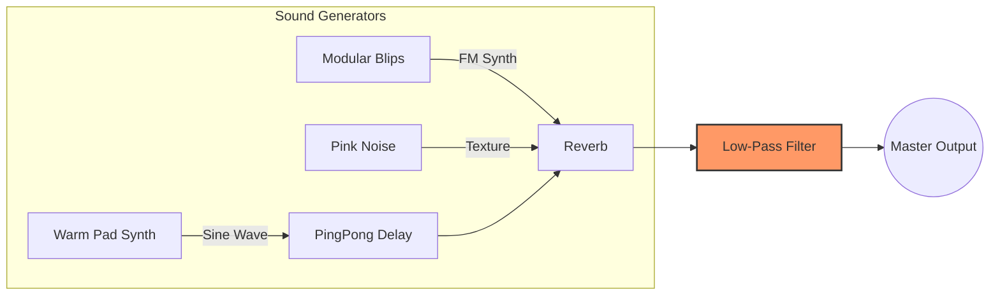

## 🇰🇷 한국어 (Korean)

# 🎧 DevFocus: Generative Flow State Timer

demo: https://devfocus-flow.vercel.app/

**DevFocus**는 개발자와 디자이너의 몰입(Flow State)을 위해 설계된 **웹 기반 생성형 앰비언트 타이머**입니다.
정해진 음악을 반복 재생하는 것이 아니라, 알고리즘에 의해 실시간으로 생성되는 무한한 사운드스케이프를 제공합니다.


## ✨ Key Features

### 1\. Generative Ambient Engine (생성형 오디오)

  - **Brian Eno's Phasing Logic:** 브라이언 이노의 'Music for Airports'에서 영감을 받은 위상 변화 기법을 적용했습니다. 서로 다른 소수(Prime Number) 주기를 가진 루프들이 겹치고 어긋나며, 이론상 수년 동안 반복되지 않는 멜로디 패턴을 만듭니다.
  - **Stochastic Sequencing:** 모든 음표는 확정된 것이 아니라 확률(Probability)에 의해 연주됩니다. 이는 음악이 예측 불가능하면서도 자연스러운 '여백'을 갖게 합니다.

### 2\. Developer-Centric UI/UX

  - **Terminal Style Logging:** 오디오 엔진 내부에서 발생하는 이벤트(Note Trigger, Loop Cycle)를 터미널 로그 형태로 시각화하여, 개발자에게 익숙하고 편안한 시각적 피드백을 제공합니다.
  - **Direct Input Timer:** 팝업이나 복잡한 설정 없이, 타이머 숫자를 클릭하여 바로 시간을 수정할 수 있는 직관적인 인터페이스를 구현했습니다.
  - **Dark Mode Optimization:** 장시간 모니터를 보는 환경을 고려하여 GitHub Dark Dimmed 테마와 유사한 색상 팔레트(Low Contrast)를 사용했습니다.

## 🛠 Technical Implementation

이 프로젝트는 외부 무거운 프레임워크 없이 **Vanilla JS**와 **Tone.js** (Web Audio API Wrapper) 만으로 구현되었습니다.

## 1\. Audio Architecture (Signal Flow)

DevFocus의 사운드 엔진은 **Tone.js**를 사용하여 3개의 사운드 소스(Source)가 이펙트 체인(Chain)을 통과하며 하나의 '공간감 있는 소리'로 합쳐지는 구조입니다.

### 🎛️ Signal Flow Diagram (신호 흐름도)



### 🔍 Component Details (상세 설명)

1.  **Generators (소리의 원천)**

      * **Warm Pad (`Tone.PolySynth` + `Sine`):**
          * 가장 순수한 파형인 \*\*사인파(Sine Wave)\*\*를 사용했습니다. 배음(Harmonics)이 적어 귀가 피로하지 않습니다.
          * **Envelope:** Attack(2s)과 Release(5s)를 길게 주어, 건반을 누르는 느낌이 아니라 **'안개처럼 피어오르는'** 효과를 냈습니다.
      * **Modular Blips (`Tone.FMSynth`):**
          * 주파수 변조(FM) 방식을 사용하여 톡톡 튀는 물방울 소리나 종소리 같은 **금속성 질감**을 만듭니다.
          * 불규칙한 리듬으로 재생되어, 정적인 음악에 생동감(Randomness)을 부여합니다.
      * **Texture (`Tone.Noise` - Pink):**
          * 완전한 무음(Digital Silence)은 오히려 긴장감을 줄 수 있습니다. 백색 소음보다 부드러운 **핑크 노이즈**를 아주 작게(-48dB) 깔아서, 아날로그 테이프 같은 따뜻한 바닥 소음을 형성합니다.

2.  **Processors (이펙트 체인)**

      * **PingPong Delay:** 소리가 왼쪽/오른쪽으로 번갈아 가며 메아리칩니다. 스테레오 이미지를 넓혀 공간감을 확장합니다.
      * **Reverb (Decay: 12s):** 아주 긴 잔향 시간을 설정하여, 마치 거대한 성당이나 우주 공간에 있는 듯한 느낌을 줍니다.
      * **Low-Pass Filter (The Key to 'Soft Tone'):**
          * **핵심 기술:** 마스터 출력 직전에 **1000Hz Low-Pass Filter**를 걸었습니다.
          * **이유:** 1000Hz 이상의 고음역대(날카로운 소리)를 깎아내어, 장시간 들어도 귀가 멍해지지 않는 \*\*'Lo-fi(로파이)하고 먹먹한 톤'\*\*을 완성했습니다.


## 2\. Log System (Algorithmic Visualization)

화면 하단에 흐르는 로그는 단순한 장식이 아니라, **생성형 알고리즘이 실제로 작동하고 있음을 보여주는 디버깅 레이어**입니다.

### 📝 Log Anatomy (로그 구조 분석)

로그 한 줄에는 다음과 같은 정보가 담겨 있습니다.

`[02:35:21.374] LOOP_GAMMA :: emit(C#4) vol:0.45`

1.  **Timestamp (`[02:35:21.374]`):**
      * 밀리초(ms) 단위까지 표시하여 시스템의 정교함을 시각화합니다.
2.  **Source ID (`LOOP_GAMMA`):**
      * 현재 소리를 낸 루프(Loop)가 누구인지 식별합니다. (예: `PAD_LAYER`는 배경음, `MOD_SEQ`는 튀는 소리)
      * 브라이언 이노의 기법처럼 각 루프는 서로 다른 주기(7박자, 11박자 등)로 돌아가며 어긋납니다.
3.  **Action (`emit(C#4)`):**
      * **Generative Logic:** 알고리즘이 `Scale` 배열 중에서 무작위로 선택한 음계(Note)입니다.
      * 이전 코드에서는 `Frequency` 객체 자체가 찍혔으나, `.toNote()` 메서드를 통해 사람이 읽을 수 있는 음계(예: C\#4, F\#4)로 변환했습니다.
4.  **Velocity (`vol:0.45`):**
      * 음의 세기입니다. 이 또한 랜덤하게 변하여 기계적인 느낌을 덜어줍니다.

### ⚡ Technical Highlight: Audio-Visual Sync

웹 오디오 프로그래밍에서 가장 어려운 점은 **'소리가 나는 시점'과 '화면이 바뀌는 시점'을 맞추는 것**입니다.

  * **문제점:** 자바스크립트의 오디오 스케줄링은 성능을 위해 \*\*"미리 예약(Look Ahead)"\*\*하는 방식입니다. 단순히 코드를 실행할 때 `console.log`를 찍으면, 소리가 나기도 전에 로그가 먼저 떠버립니다.
  * **해결책 (`Tone.Draw`):**
      * `Tone.Draw.schedule(callback, time)` 함수를 사용했습니다.
      * 이 함수는 오디오 스레드의 정확한 시간(`time`)을 감시하다가, **실제 소리가 스피커에서 재생되는 그 순간**에 맞춰 콜백 함수(로그 출력 UI)를 실행합니다.
      * 이 덕분에 소리가 '딩\~' 하고 울리는 순간에 정확히 로그가 뜨고 빛망울(Halo)이 반짝이는 것입니다.

### Code Snippet (Core Logic)

```javascript
// Example: Using Prime Number Intervals for Phasing
const loopIntervals = ["7n", "11n", "13n"]; // 7, 11, 13 beat subdivisions

new Tone.Loop(time => {
    // 60% probability to play a note
    if (Math.random() < 0.6) {
        // ...trigger sound...
    }
}, "7n").start(0);
```

## 🚀 How to Run

이 프로젝트는 단일 HTML 파일로 구성되어 있어 별도의 빌드 과정이 필요 없습니다.

1.  Clone the repository:
    ```bash
    git clone https://github.com/YOUR_USERNAME/DevFocus.git
    ```
2.  Open `index.html` in your browser.
3.  Click **START FOCUS** to initialize the AudioContext.

## 📚 Tech Stack

  * **HTML5 / CSS3:** Modern Flexbox layout, CSS Variables for theming.
  * **JavaScript (ES6+):** Async/Await audio initialization.
  * **Tone.js:** Web Audio API library for synthesis and scheduling.

## 📝 License

This project is open source and available under the [MIT License](https://www.google.com/search?q=LICENSE).

---
## 🇺🇸 English

# 🎧 DevFocus: Generative Flow State Timer

Demo: [https://devfocus-flow.vercel.app/](https://devfocus-flow.vercel.app/)

**DevFocus** is a **web-based generative ambient timer** designed to aid developers and designers in achieving a state of flow. Instead of repeating a fixed music track, it provides an infinite soundscape generated in real-time by an algorithm.

## ✨ Key Features

### 1\. Generative Ambient Engine

  * **Brian Eno's Phasing Logic:** Inspired by Brian Eno's 'Music for Airports,' it utilizes a phasing technique. Loops with different prime number durations overlap and drift, creating melodic patterns that are theoretically non-repeating for years.
  * **Stochastic Sequencing:** All notes are not predetermined but are played based on probability, allowing the music to be unpredictable and possess natural 'space' or 'rest.'

### 2\. Developer-Centric UI/UX

  * **Terminal Style Logging:** Events occurring inside the audio engine (Note Trigger, Loop Cycle) are visualized as terminal logs, offering familiar and comfortable visual feedback to developers.
  * **Direct Input Timer:** Implements an intuitive interface where users can directly modify the timer duration by clicking on the numbers, without pop-ups or complex settings.
  * **Dark Mode Optimization:** A low-contrast color palette, similar to the GitHub Dark Dimmed theme, is used for environments involving long hours of screen viewing.

## 🛠 Technical Implementation

The project is built using only **Vanilla JS** and **Tone.js** (a Web Audio API Wrapper), without relying on heavy external frameworks.

### 1\. Audio Architecture (Signal Flow)

DevFocus's sound engine uses **Tone.js** where three sound sources pass through an effect chain to be combined into one 'spatial sound.'

#### 🎛️ Signal Flow Diagram


#### 🔍 Component Details

1.  **Generators (Sound Sources)**
      * **Warm Pad (`Tone.PolySynth` + `Sine`):** Uses the purest waveform, **Sine Wave**, which has fewer harmonics and is less fatiguing on the ears. **Envelope:** A long Attack (2s) and Release (5s) create an **'emerging mist'** effect rather than a distinct key press.
      * **Modular Blips (`Tone.FMSynth`):** Frequency Modulation (FM) synthesis creates a **metallic texture** like water droplets or bells. Plays with irregular rhythms to add a sense of movement (Randomness) to the static music.
      * **Texture (`Tone.Noise` - Pink):** Smooth **Pink Noise** is layered very softly (-48dB) beneath the mix, creating a warm floor-noise reminiscent of analog tape, as complete silence can be unsettling.
2.  **Processors (Effect Chain)**
      * **PingPong Delay:** The sound echoes alternately between left/right, widening the stereo image and expanding the spatial feel.
      * **Reverb (Decay: 12s):** A very long decay time is set to evoke the feeling of being in a massive cathedral or outer space.
      * **Low-Pass Filter (The Key to 'Soft Tone'):** **Core Technique:** A **1000Hz Low-Pass Filter** is applied just before the master output. **Reason:** This cuts out high frequencies above 1000Hz (sharp sounds), achieving a **'Lo-fi and muffled tone'** that doesn't cause ear fatigue during extended listening.

### 2\. Log System (Algorithmic Visualization)

The log stream at the bottom of the screen is not mere decoration but a **debugging layer that shows the generative algorithm in action**.

#### 📝 Log Anatomy

`[02:35:21.374] LOOP_GAMMA :: emit(C#4) vol:0.45`

1.  **Timestamp (`[02:35:21.374]`):** Displays down to milliseconds (ms), visualizing the system's precision.
2.  **Source ID (`LOOP_GAMMA`):** Identifies the loop that triggered the sound. (Each loop runs on a different prime number cycle.)
3.  **Action (`emit(C#4)`):** The note (scale) randomly selected by the algorithm from the `Scale` array.
4.  **Velocity (`vol:0.45`):** The volume of the note, which is also randomized to reduce a mechanical feel.

#### ⚡ Technical Highlight: Audio-Visual Sync

The challenge in web audio programming is aligning **'when the sound is played'** with **'when the screen changes.'**

  * **Problem:** JavaScript audio scheduling uses a **"look ahead"** technique for performance. If you simply `console.log` when the code executes, the log appears before the sound is actually heard.
  * **Solution (`Tone.Draw`):** The `Tone.Draw.schedule(callback, time)` function is used. This function monitors the exact time (`time`) on the audio thread and executes the callback function (UI log output) **precisely when the sound is played through the speakers**. This ensures the log appears and the halo effect twinkles the moment the sound 'rings out.'

#### Code Snippet (Core Logic)

```javascript
// Example: Using Prime Number Intervals for Phasing
const loopIntervals = ["7n", "11n", "13n"]; // 7, 11, 13 beat subdivisions

new Tone.Loop(time => {
    // 60% probability to play a note
    if (Math.random() < 0.6) {
        // ...trigger sound...
    }
}, "7n").start(0);
```

## 🚀 How to Run

This project consists of a single HTML file and requires no separate build process.

1.  Clone the repository:
    ```bash
    git clone https://github.com/YOUR_USERNAME/DevFocus.git
    ```
2.  Open `index.html` in your browser.
3.  Click **START FOCUS** to initialize the AudioContext.

## 📚 Tech Stack

  * **HTML5 / CSS3:** Modern Flexbox layout, CSS Variables for theming.
  * **JavaScript (ES6+):** Async/Await audio initialization.
  * **Tone.js:** Web Audio API library for synthesis and scheduling.

## 📝 License

This project is open source and available under the [MIT License](https://www.google.com/search?q=LICENSE).
