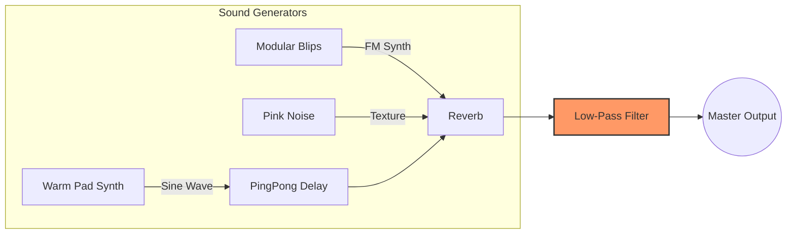

# 🎧 DevFocus: Generative Flow State Timer

Demo: [https://devfocus-flow.vercel.app/](https://devfocus-flow.vercel.app/)

**DevFocus** is a **web-based generative ambient timer** designed to aid developers and designers in achieving a state of flow. Instead of repeating a fixed music track, it provides an infinite soundscape generated in real-time by an algorithm.

## ✨ Key Features

### 1\. Generative Ambient Engine

  * **Brian Eno's Phasing Logic:** Inspired by Brian Eno's 'Music for Airports,' it utilizes a phasing technique. Loops with different prime number durations overlap and drift, creating melodic patterns that are theoretically non-repeating for years.
  * **Stochastic Sequencing:** All notes are not predetermined but are played based on probability, allowing the music to be unpredictable and possess natural 'space' or 'rest.'

### 2\. Developer-Centric UI/UX

  * **Terminal Style Logging:** Events occurring inside the audio engine (Note Trigger, Loop Cycle) are visualized as terminal logs, offering familiar and comfortable visual feedback to developers.
  * **Direct Input Timer:** Implements an intuitive interface where users can directly modify the timer duration by clicking on the numbers, without pop-ups or complex settings.
  * **Dark Mode Optimization:** A low-contrast color palette, similar to the GitHub Dark Dimmed theme, is used for environments involving long hours of screen viewing.

## 🛠 Technical Implementation

The project is built using only **Vanilla JS** and **Tone.js** (a Web Audio API Wrapper), without relying on heavy external frameworks.

### 1\. Audio Architecture (Signal Flow)

DevFocus's sound engine uses **Tone.js** where three sound sources pass through an effect chain to be combined into one 'spatial sound.'

#### 🎛️ Signal Flow Diagram



#### 🔍 Component Details

1.  **Generators (Sound Sources)**
      * **Warm Pad (`Tone.PolySynth` + `Sine`):** Uses the purest waveform, **Sine Wave**, which has fewer harmonics and is less fatiguing on the ears. **Envelope:** A long Attack (2s) and Release (5s) create an **'emerging mist'** effect rather than a distinct key press.
      * **Modular Blips (`Tone.FMSynth`):** Frequency Modulation (FM) synthesis creates a **metallic texture** like water droplets or bells. Plays with irregular rhythms to add a sense of movement (Randomness) to the static music.
      * **Texture (`Tone.Noise` - Pink):** Smooth **Pink Noise** is layered very softly (-48dB) beneath the mix, creating a warm floor-noise reminiscent of analog tape, as complete silence can be unsettling.
2.  **Processors (Effect Chain)**
      * **PingPong Delay:** The sound echoes alternately between left/right, widening the stereo image and expanding the spatial feel.
      * **Reverb (Decay: 12s):** A very long decay time is set to evoke the feeling of being in a massive cathedral or outer space.
      * **Low-Pass Filter (The Key to 'Soft Tone'):** **Core Technique:** A **1000Hz Low-Pass Filter** is applied just before the master output. **Reason:** This cuts out high frequencies above 1000Hz (sharp sounds), achieving a **'Lo-fi and muffled tone'** that doesn't cause ear fatigue during extended listening.

### 2\. Log System (Algorithmic Visualization)

The log stream at the bottom of the screen is not mere decoration but a **debugging layer that shows the generative algorithm in action**.

#### 📝 Log Anatomy

`[02:35:21.374] LOOP_GAMMA :: emit(C#4) vol:0.45`

1.  **Timestamp (`[02:35:21.374]`):** Displays down to milliseconds (ms), visualizing the system's precision.
2.  **Source ID (`LOOP_GAMMA`):** Identifies the loop that triggered the sound. (Each loop runs on a different prime number cycle.)
3.  **Action (`emit(C#4)`):** The note (scale) randomly selected by the algorithm from the `Scale` array.
4.  **Velocity (`vol:0.45`):** The volume of the note, which is also randomized to reduce a mechanical feel.

#### ⚡ Technical Highlight: Audio-Visual Sync

The challenge in web audio programming is aligning **'when the sound is played'** with **'when the screen changes.'**

  * **Problem:** JavaScript audio scheduling uses a **"look ahead"** technique for performance. If you simply `console.log` when the code executes, the log appears before the sound is actually heard.
  * **Solution (`Tone.Draw`):** The `Tone.Draw.schedule(callback, time)` function is used. This function monitors the exact time (`time`) on the audio thread and executes the callback function (UI log output) **precisely when the sound is played through the speakers**. This ensures the log appears and the halo effect twinkles the moment the sound 'rings out.'

#### Code Snippet (Core Logic)

```javascript
// Example: Using Prime Number Intervals for Phasing
const loopIntervals = ["7n", "11n", "13n"]; // 7, 11, 13 beat subdivisions

new Tone.Loop(time => {
    // 60% probability to play a note
    if (Math.random() < 0.6) {
        // ...trigger sound...
    }
}, "7n").start(0);
```

## 🚀 How to Run

This project consists of a single HTML file and requires no separate build process.

1.  Clone the repository:
    ```bash
    git clone https://github.com/YOUR_USERNAME/DevFocus.git
    ```
2.  Open `index.html` in your browser.
3.  Click **START FOCUS** to initialize the AudioContext.

## 📚 Tech Stack

  * **HTML5 / CSS3:** Modern Flexbox layout, CSS Variables for theming.
  * **JavaScript (ES6+):** Async/Await audio initialization.
  * **Tone.js:** Web Audio API library for synthesis and scheduling.

## 📝 License

This project is open source and available under the [MIT License](https://www.google.com/search?q=LICENSE).

